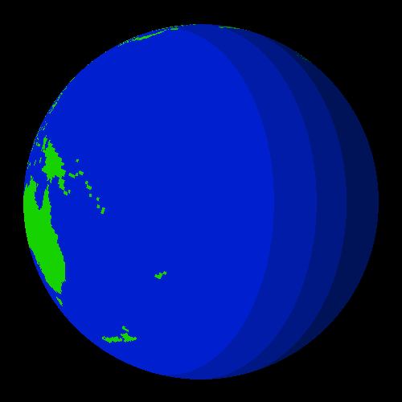

# C - 3D Rotating Earth
A 5 minute ray trace project that generates a rotating earth GIF from nothing but C code using the [CGIF library by dloebl](https://github.com/dloebl/cgif). The python script 'tohex.py' was used to convert image data into a C array.

